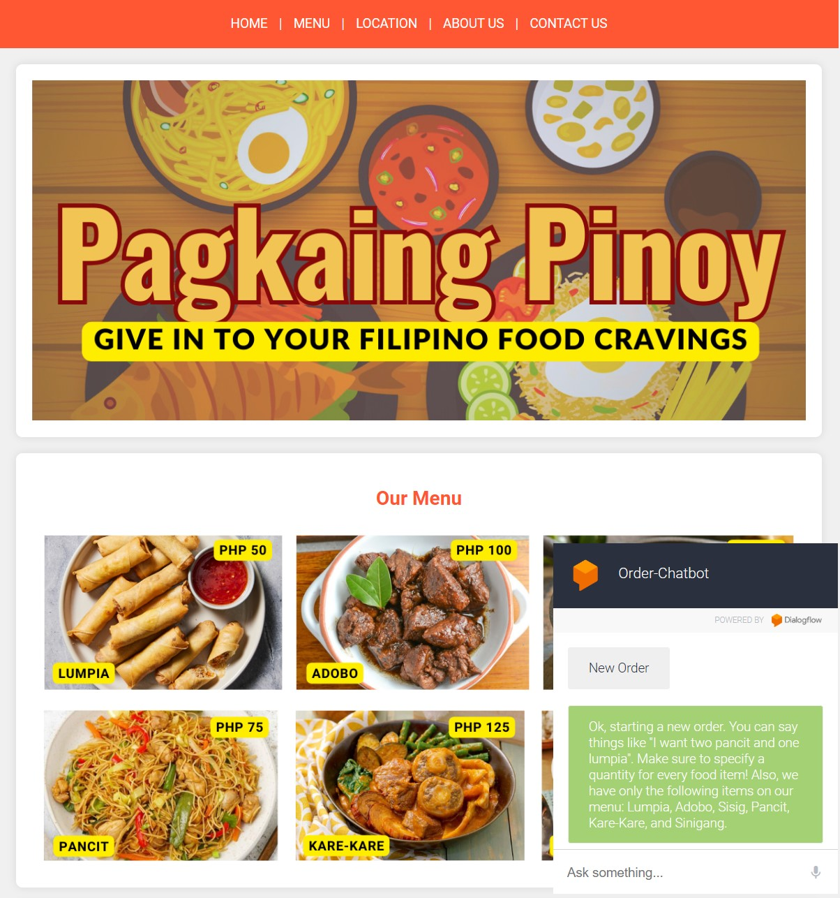
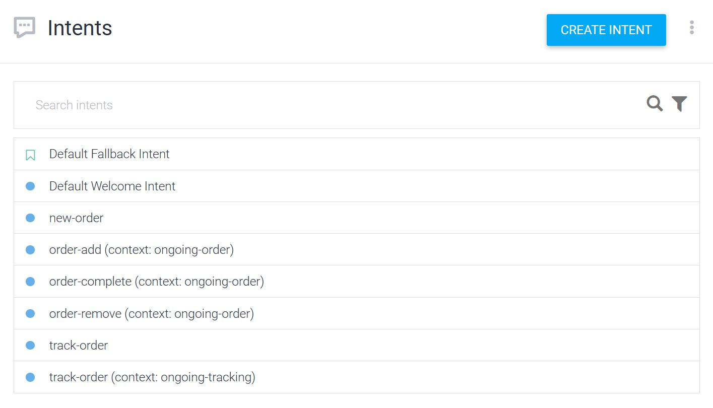
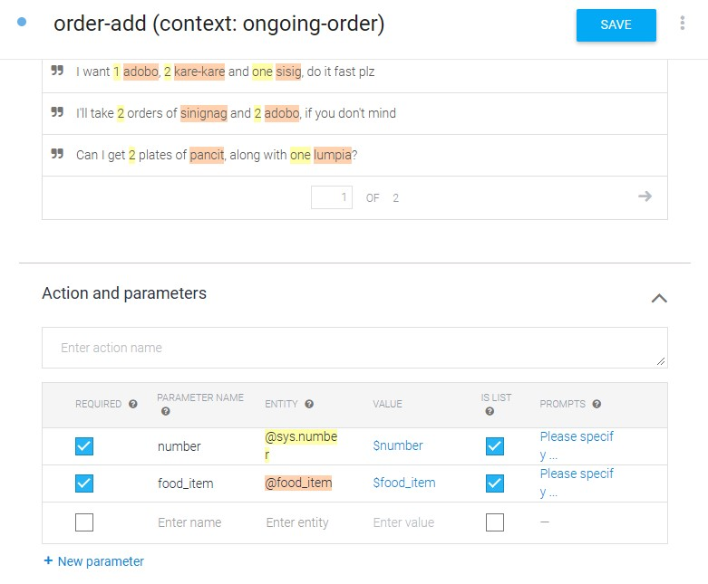
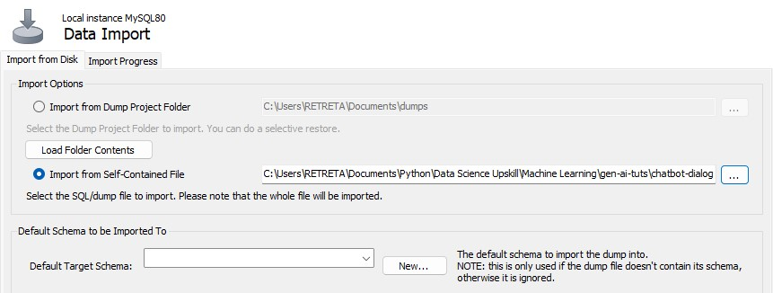
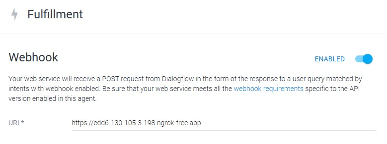
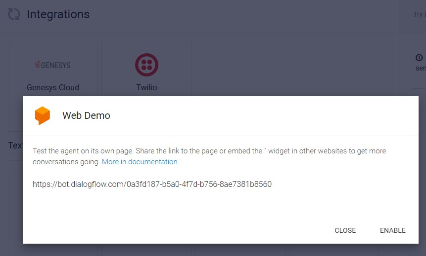

# Food Ordering Chatbot

This project is a Google Dialogflow-powered chatbot order management system that uses FastAPI as its backend server to handle food orders through a conversational interface. It integrates with a MySQL database for managing order processing, tracking, and retrieval.

<p align="center">
  
  <br>
  <em>Filipino Food Website with Order Chatbot Integration</em>
</p>

## Key Features

- Handle food order requests via a chatbot interface
- Add and remove items from an ongoing order
- Complete orders and save them to the database
- Track order status
- Retrieve total order prices

## How It Works
1. The user enters an order through the UI using natural language and this initiates Dialogflow to create a POST request based to the backend server based on the prompt context.
2. The system uses FastAPI to create an API endpoint that receives POST requests.
3. Incoming requests are processed by the `ChatBotOperations` class, which handles different intents:
   - Adding items to an order
   - Removing items from an order
   - Completing an order
   - Tracking an order's status
4. The `DBOperations` class manages all database interactions with MySQL, including:
   - Saving orders to the database
   - Retrieving order status
   - Calculating total order prices

## Project Structure

- `main.py`: Contains the FastAPI application and request handling logic
- `chatbot_operations.py`: Implements the `ChatBotOperations` class for processing different intents
- `db_operations.py`: Implements the `DBOperations` class for database interactions
- `utils.py`: Contains utility functions for string manipulation and session ID extraction

## Setup and Installation

### 1. Create Dialogflow agent
- Create a new agent in the Dialogflow ES console
- Add `Intents` to the agent. Use the contents of the `dialogflow_assets` folder as guide of what intents to make.

<p align="center">
  
  <br>
  <em>Intents for Chatbot Agent</em>
</p>

- Populate each intent with its corresponding training phrases. Annotate the training phrases to assign parameters.

<p align="center">
  
  <br>
  <em>Sample Training Phrase Annotation</em>
</p>

- Enable webhook call fulfillment option for the following intents:
`order-add (context: ongoing-order)`, `order-complete (context: ongoing-order)`, `order-remove (context: ongoing-order)`, and `track-order (context: ongoing-tracking)`

### 2. Initialize MySQL database
- Create database schema from the `pagkaing_pinoy.sql` file
- This can be done programatically or simply import the file in `MySQL Workbench` (assuming MySQL is installed in your machine)
<p align="center">
  
  <br>
  <em>MySQL Data Import</em>
</p>


### 3. Run backend server
- Input the command below to run the FastAPI app. Ensure that run the command from inside the `/backend` directory
```
uvicorn main:app
```
- Run the next command in a separate terminal to enable https tunneling. Https is required protocol to connect to Dialogflow
```
ngrok http 8000
```

### 4. Connect backend to Dialogflow
- Enable the `Webhook` functionality found in the `Fulfillment` tab of the Dialogflow ES console
- Provide the URL given by the `ngrok` command 
<p align="center">
  
  <br>
  <em>Sample Input of Ngrok-provided URL</em>
</p>

### 5. Allow Web Integration
- Enable the `Web Demo` integration in the `Integrations` tab of the Dialogflow ES console
<p align="center">
  
  <br>
  <em>Enabling of Web Demo Integration</em>
</p>


## Usage

To have a hands-on experience on the functionality of the chatbot, open the `home.html` file located in the `/frontend` folder.
```
# SAMPLE CONVERSATION

User: Hi

Bot: Greetings! How can I assist? You can say "New Order" or "Track Order"

User: New order

Bot: Starting new order. Specify food items and quantities. For example, you can say, "I would like to order two pancit and one lumpia. Also, we have only the following items on our menu: Lumpia, Adobo, Sisig, Pancit, Kare-Kare, and Sinigang.

User: I would like to order 1 lumpia and 2 sisig

Bot: So far you have: 1 Lumpia, 2 Sisig. Do you need anything else?

User: Add 2 pancit too

Bot: So far you have: 1 Lumpia, 2 Sisig, 2 Pancit. Do you need anything else?

User: I changed my mind. Remove the sisig pls

Bot: Removed Sisig from your order! Here is what is left in your order: 1 Lumpia, 2 Pancit. Anything else?

User: That's it

Bot: Awesome. We have placed your order. Here is your order id # 42. Your order total is PHP 200.00 which you can pay at the time of delivery!
```

## Recommendations
- For a more complex use-case, use Dialogflow CX 
- Host the backend server and website to cloud instances like AWS EC2
- Create a permanent https protocol to avoid changing the webhook URL every time


